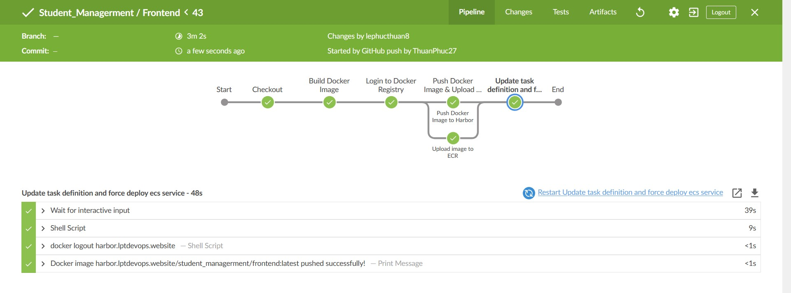

# ECS Deployment with Terraform and Jenkins

## Overview
This project automates the deployment of a containerized application on AWS ECS (Fargate) using Terraform and Jenkins. The infrastructure includes load balancing, database management, secure access control, and monitoring.

### Components
- **AWS ECS (Fargate)**: Runs the containerized application.
- **AWS ALB (Application Load Balancer)**: Distributes traffic to ECS tasks.
- **AWS DocumentDB**: Managed database service for storage.
- **AWS IAM Roles & Policies**: Ensures secure access control.
- **AWS CloudWatch**: Collects logs and monitors ECS tasks.
- **AWS Route 53**: Manages domain name resolution.
- **AWS Amazon Access Manager**: Manages access to AWS resources.
- **AWS Secrets Manager**: Stores sensitive configuration data securely.
- **AWS VPC**: Provides a secure and isolated network environment.

### Architecture

### Resources and pipeline

## CI/CD Pipeline
The deployment pipeline is managed using Jenkins, ensuring continuous integration and continuous deployment (CI/CD) with infrastructure as code (IaC) practices.

